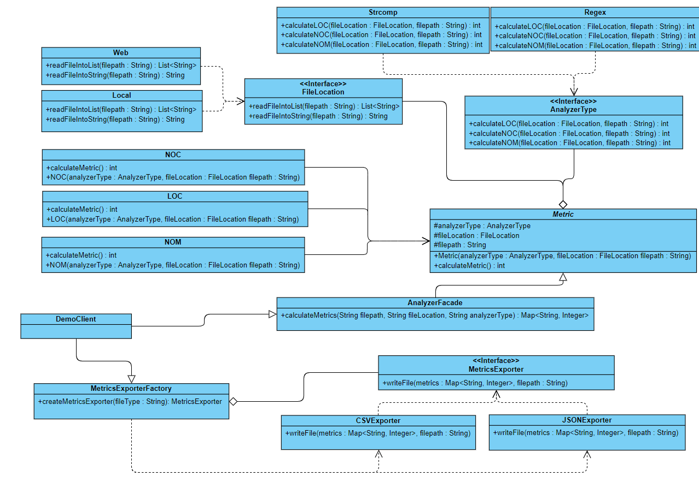

# Source Code Analyzer

## Purpose of this module

This module is here to help you analyze files of source code by exporting a file with metrics of
such as LOC, NOM, NOC. It also allows you to analyze a file in different methods such as regex or strcomp.
The module also allows for different storage locations such locally or on the web. The actual purpose is to 
see how to rebuild a project having in mind that someone may want to add his own analyzer types, metrics etc.

## Getting Started

First you need to clone the repository in a folder of your preference. Then through the command line head to the root directory of your project and 
execute the command:
```
mvn clean package jacoco:report
```
This will let you package the project, see how the classes are being tested,  and generate a code coverall report in the folder :
```
target/site/jacoco
```

In order to run the project and get the output you need to first transfer preferable in the resources file
and then execute a command such as the following:
```
java –jar “jar-with-dependencies” arg0 arg1 arg2 arg3 arg4
```
Where args translate to:

* arg0 : “JavaSourceCodeInputFile” (e.g., src/test/resources/TestClass.java)
* arg1 : “sourceCodeAnalyzerType” [regex|strcomp]
* arg2 : “SourceCodeLocationType” [local|web]
* arg3 : “OutputFilePath” (e.g., ../output_metrics_file)
* arg4 : “OutputFileType” [csv|json]

One example is:
```
java –jar ./target/sourcecodeanalyzer-0.0.1-SNAPSHOT-jar-with-dependencies.jar ./src/test/resources/TestClass.java regex local metrics_results csv
```

## Documentation of decisions

The UML Diagram that the module is build on is the following:



### Metrics Exporter

In the metrics exporter part of the module (classes : MetricsExporterFactory, MetricsExporter, CSVExporter, JSONExporter) I used the Factory on Strategy pattern for the following reasons:
* Separations of concerns - The instantiation of JSON and CSV classes are separated and done in the factory
* Flexibility - It is easy to extend the function by adding a new type withoud affecting the client

### Code Analyzer

In the code analyzer funtcion I used a facade class and combined the rest with a bridge strategy for the following reasons:
* Facade (AnalyzerFacade) - Easy to hide functonality of the project and let the client perform actions using just one method providing a simple interface. Making any types of changes under the files of the facade has no affect on the client.
* Bridge (Metrics (+LOC,NOC,NOM) - FileLocation (+Local,Web) - AnalyzerType (+Strcomp,Regex))- Types of metrics and types of analyzing types can vary independently so adding a new metric does has no affects on FileLocation and has few
affects on analyzer type, adding an analyzer type has no affect on the Metrics etc. Metrics serves an abstract class for the metrics that can be added and is connected with bridges to the other two classes that help with the calculations. AnalyzerType serves as the interface of
the analyzer types. FileLocation serves as the interface of the possible file store locations.

## Dependencies

**Mockito Dependency**
```
	<dependency>
		<groupId>org.mockito</groupId>
		<artifactId>mockito-core</artifactId>
		<version>2.27.0</version>
		<scope>test</scope>
	</dependency>
```

**Jacoco plugin**
```
	<plugin>
		<groupId>org.jacoco</groupId>
		<artifactId>jacoco-maven-plugin</artifactId>
		<version>0.8.3</version>
		<executions>
			<execution>
				<id>prepare-agent</id>
				<goals>
					<goal>prepare-agent</goal>
				</goals>
			</execution>
		</executions>
	</plugin>

```

**Coveralls plugin**
```
	<plugin>
		<groupId>org.eluder.coveralls</groupId>
		<artifactId>coveralls-maven-plugin</artifactId>
		<version>4.3.0</version>
	</plugin>
```


